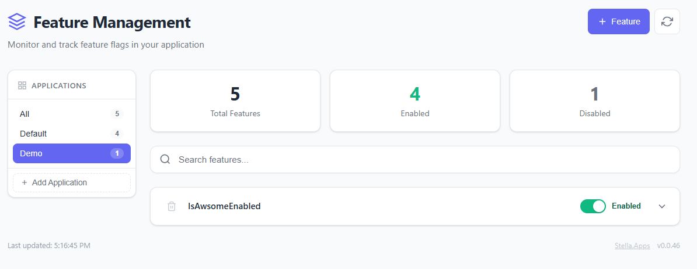

# Stella.FeatureManagement.Dashboard
[](https://github.com/rochar/Stella.FeatureManagement.Dashboard/actions/workflows/ci.yml)
[](https://www.nuget.org/packages/Stella.FeatureManagement.Dashboard)
[](https://www.nuget.org/packages/Stella.FeatureManagement.Dashboard)


A ready-to-use web dashboard for managing feature flags in ASP.NET Core applications. Built on top of Microsoft.FeatureManagement with PostgreSQL persistence, it provides a web UI and REST APIs to view, enable, disable, and configure feature flags at runtime.



## Installation

Install via NuGet Package Manager:

```bash
dotnet add package Stella.FeatureManagement.Dashboard
```

Or via Package Manager Console:

```powershell
Install-Package Stella.FeatureManagement.Dashboard
```

## Quick Start

> **Note:** This library currently uses PostgreSQL as the database provider for storing feature flags.

### 1. Register Services

In your `Program.cs`, add the Feature Management services with the dashboard:

```csharp
...
using Stella.FeatureManagement.Dashboard;
...
// Add Feature Management with Dashboard
builder.Services.AddFeatureManagement()
    .AddFeaturesDashboard(options => options.UseNpgsql(builder.Configuration.GetConnectionString("exampledb")));

var app = builder.Build();

// Map the dashboard endpoints
app.UseFeaturesDashboard();
// Update features database model
await featureDashboard.MigrateFeaturesDatabaseAsync();

// Ensure default features are initialized
await featureDashboard.RegisterManagedFeaturesAsync([
    new ManagedFeature("MyFlag", "My feature flag description", true),
    new ManagedFeature("AnotherFlag", string.Empty, false)
]);
    
app.Run();
```

### 2. Access the Dashboard

Once your application is running, access the web dashboard at:

```
./features/dashboard/
```

### 3. REST API

You can also query feature flags programmatically via the REST API:

```bash
# Get all features
GET /features

# Response:
# true 
```

