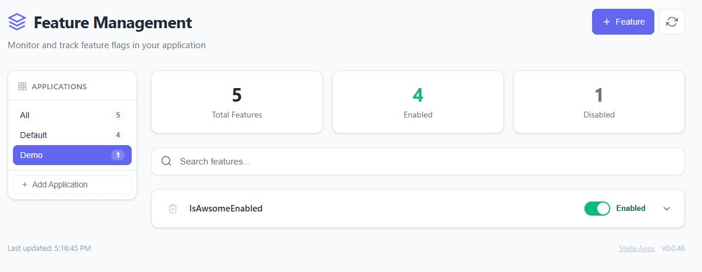

# Stella.FeatureManagement.Dashboard
[](https://github.com/rochar/Stella.FeatureManagement.Dashboard/actions/workflows/ci.yml)
[](https://www.nuget.org/packages/Stella.FeatureManagement.Dashboard)
[](https://www.nuget.org/packages/Stella.FeatureManagement.Dashboard)


A ready-to-use web dashboard for managing feature flags in ASP.NET Core applications. Built on top of Microsoft.FeatureManagement with PostgreSQL persistence, it provides a web UI and REST APIs to view, enable, disable, and configure feature flags at runtime.



## Installation

Install via NuGet Package Manager:

```bash
dotnet add package Stella.FeatureManagement.Dashboard
```

Or via Package Manager Console:

```powershell
Install-Package Stella.FeatureManagement.Dashboard
```

## Quick Start

> **Note:** This library currently uses PostgreSQL as the database provider for storing feature flags.

### 1. Register Services

In your `Program.cs`, add the Feature Management services with the dashboard:

```csharp
...
using Stella.FeatureManagement.Dashboard;
...
// Add Feature Management with Dashboard
builder.Services.AddFeatureManagement()
    .AddFeaturesDashboard(options => options.UseNpgsql(builder.Configuration.GetConnectionString("exampledb")));

var app = builder.Build();

// Map the dashboard endpoints
var featureDashboard = app.UseFeaturesDashboard();
// Update features database model
await featureDashboard.MigrateFeaturesDatabaseAsync();

// Ensure default features are initialized
await featureDashboard.RegisterManagedFeaturesAsync([
    new ManagedFeature("MyFlag", "My feature flag description", true),
    new ManagedFeature("AnotherFlag", string.Empty, false)
]);
    
app.Run();
```

### 2. Access the Dashboard

Once your application is running, access the web dashboard at:

```text
/features/dashboard/
```

### 3. Rate Limiting

You can protect the `/features/{featureName}` endpoint with rate limiting by registering a policy and passing its name:

```csharp
using System.Threading.RateLimiting;
using Stella.FeatureManagement.Dashboard;

// Register a rate limiting policy
builder.Services.AddRateLimiter(options =>
{
    options.AddFixedWindowLimiter("featuresPolicy", opt =>
    {
        opt.Window = TimeSpan.FromSeconds(10);
        opt.PermitLimit = 100;
        opt.QueueLimit = 0;
    });
});

var app = builder.Build();

// Enable the rate limiter middleware
app.UseRateLimiter();

// Pass the policy name to UseFeaturesDashboard
var featureDashboard = app.UseFeaturesDashboard(rateLimitingPolicy: "featuresPolicy");
```

### 4. REST API

You can query feature state through the public endpoint and manage dashboard data through the dashboard API:

```text
GET /features/{featureName}
GET /features/dashboardapi/features
GET /features/dashboardapi/filters
GET /features/dashboardapi/applications
```

The `/features/{featureName}` endpoint returns a boolean feature state. The `/features/dashboardapi/*` endpoints are used by the dashboard UI for feature management.

## Agentic Workflow

Every change — feature, bug, refactor — flows through three stages. **The user moves work between stages manually**; there is no autopilot orchestrator across stages. The full specification is in [`.github/agents/WORKFLOW.md`](.github/agents/WORKFLOW.md).

### Stage 1 — Plan

Driver: `stella-stage-1-plan-author`

The planner agent drafts a plan, presents it to you, and **iterates until you approve**. It bakes in a critical-thinking pass (probes assumptions, edge cases, risks) before each presentation. Output is saved to `.github/plans/<type>-<slug>-<n>.md` and the agent fills in a `## Reviews` section listing the domain reviewers required for the plan's scope.

### Stage 2 — Review

Driver: `stella-stage-2-plan-reviewer`

You hand off the approved plan. This orchestrator agent reads the plan's `## Reviews` section and **automatically invokes** every listed reviewer (in parallel where possible), updates each row's status, and returns a consolidated report. Reviewers it can call:

| Plan touches | Reviewer |
| --- | --- |
| Backend / .NET design | `dotnet-self-learning-architect` |
| Frontend / React | `expert-react-frontend-engineer` |
| UI / accessibility | `accessibility` |
| API contract | `api-architect` |
| CI / GitHub Actions | `github-actions-expert` |
| Security | `software-engineering-team:se-security-reviewer` (plugin) |
| Test strategy | `stella-test-strategy-reviewer` |

If any reviewer requests changes, control returns to you — loop back to Stage 1 to update the plan, then re-run Stage 2.

### Stage 3 — Implement

Driver: `stella-stage-3-phase-implementer`

Invoke the orchestrator with the approved plan path and a phase identifier (e.g. `Phase 1`). It dispatches the phase's declared `Implementer:` agent, re-runs the plan's Stage 2 reviewers against the diff, then runs the built-in `code-review` sub-agent and the `software-engineering-team:se-security-reviewer` plugin. Trivial findings (formatting, local renames, typos, missing doc comments, unused imports) are applied inline; anything non-trivial pauses for your decision. After the pre-commit gate passes, it updates the plan and invokes `stella-commit-reviewer` to produce the Conventional Commit.

> See the full [Agent Catalog](.github/agents/README.md) for operating rules, the overlap guide, scenario examples, and the complete agent list.

## Copilot CLI Plugins

Copilot CLI plugins are installed at the **user level** (under `~/.copilot/installed-plugins/`) and are NOT committed to the repository. Run the bootstrap script once after installing the Copilot CLI so you get the same agents, skills, and instructions as the rest of the team:

```powershell
# Windows / cross-platform PowerShell 6+
pwsh ./scripts/setup-copilot-cli.ps1

# Linux / macOS
./scripts/setup-copilot-cli.sh
```

Pass `-UpdateExisting` (PowerShell) or `--update` (bash) to refresh already-installed plugins.

